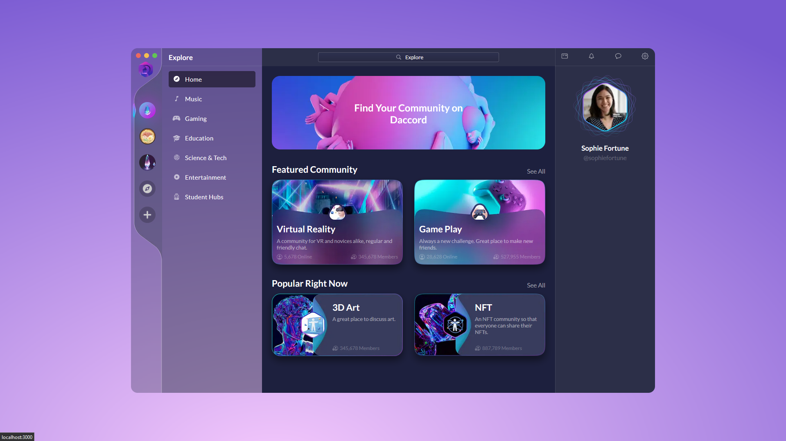

# Youniky

Este site é a implementação de um design feito no figma que pode ser encontrado aqui [Figma Design](https://www.figma.com/file/928tW4opQ13sAzJSTpFc3D/Web-App-UI-Design-(Community)?type=design&node-id=188-5060&mode=design)

  

## 💻 Pré-requisitos

Antes de começar, verifique se você atendeu aos seguintes requisitos:

* Você instalou [NodeJS](https://github.com/)

## 🚀 Rodando Daccord

* Ultilize o comando `npm install` na raiz do projeto
* Ultilize o comando `npm run dev` para iniciar o projeto